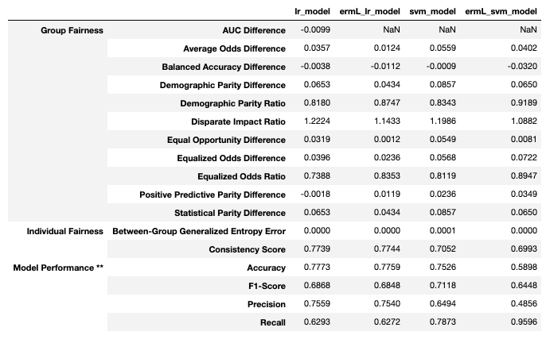
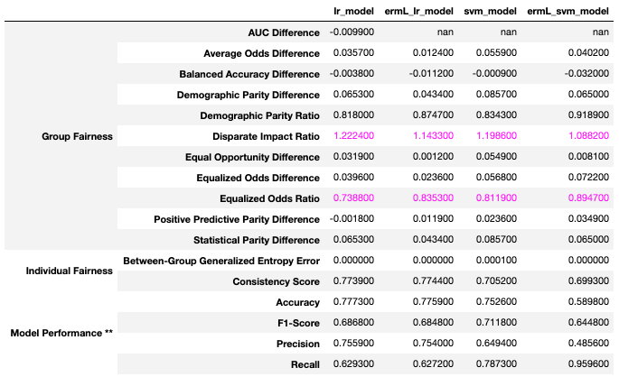

# fairMLHealth
Tools and tutorials for evaluation of fairness and bias in healthcare applications of machine learning models.


## Organization
This library is constructed in three main parts:
- ### [Tools (fairmlhealth)](fairmlhealth/README.md)
    - Methods for generating fairness comparison tables
    - Features used by templates and tutorials to facilitate comparison of multiple metrics

- ### [Templates](templates/README.md)
    - Quickstart notebooks that serve as skeletons for your model analysis

- ### [Tutorias and Examples](tutorials_and_examples/README.md)
    - Tutorials for measuring and analyzing fairness as it applies to machine learning
    - Examples for using the templates and tools

- ### [Publications](docs/publications/README.md)
    - Tutorial presentations, papers, press releases


## Installation
Installing directly from GitHub:

    python -m pip install git+https://https://github.com/KenSciResearch/fairMLHealth

Installing from a local copy of the repo:

    pip install <path_to_fairMLHealth_dir>


## Usage
### Model Comparison Tool
The primary feature of this library is the model comparison tool. The current version supports assessment of binary prediction models through use of the compare_measures function.

```python
from sklearn.naive_bayes import BernoulliNB
from sklearn.tree import DecisionTreeClassifier
from fairmlhealth import model_comparison as fhmc
# Load data
X = pd.DataFrame({'col1':[1,2,50,3,45,32], 'col2':[34,26,44,2,1,1],
                  'col3':[32,23,34,22,65,27], 'gender':[0,1,0,1,1,0]})
y = pd.DataFrame({'y':[1,0,0,1,0,1]})
split = train_test_split(X, y, test_size = 0.75, random_state=36)
X_train, X_test, y_train, y_test
#Train models
model_1 = BernoulliNB().fit(X_train, y_train)
model_2 = DecisionTreeClassifier().fit(X_train, y_train)
# Deterimine your set of protected attributes
prtc_attr = X_test['gender']
# Specify either a dict or a list of trained models to compare
model_dict = {'model_1': model_1, 'model_2': model_2}
# Pass the above to the compare models function
fhmc.compare_measures(X_test, y_test, prtc_attr, model_dict)
```

Below is an example output for a set of linear models compared to fairness-aware alternate versions of those same models. Notice that three of the models do not produce prediction probabilities, and that the tool simply adds a NaN value for any measures relying on those probabilities.



### Reporting
There are also several useful reporting features, for example the comparison highlighting tool shown below.

```python
from fairmlhealth import model_comparison as fhmc, reports
# Load data and generate models

## < load data and generate models as per example above >

# Pass the data and models to the compare models function, as above
lin_comp = fhmc.compare_measures(X_test, y_test, prtc_attr, linear_models)
# Add highlights
reports.flag_suspicious(lin_comp)
```



### Other Examples
For a more detailed example of how to use this package, please see the [Example Binary Classification Assessment](./tutorials_and_examples/Example-Template-BinaryClassificationAssessment.ipynb).

## Citations
### Repository
Allen,  C.,  Ahmad,  C.,  Muhammad  Eckert,  Hu,  J.,  &  Kumar,  V. (2020). _fairML-Health: Tools and tutorials for evaluation of fairness and bias in healthcare applications of machine learning models._ https://github.com/KenSciResearch/fairMLHealth.
```
@misc{fairMLHealth,
    title={{fairMLHealth: Tools and tutorials for evaluation of fairness and bias in healthcare applications of machine learning models.}},
    author={Allen, Christine and Ahmad, Muhammad Eckert, Carly and Hu, Juhua and Kumar, Vikas},
    year={2020},
    publisher = {GitHub},
    journal = {GitHub repository},
    howpublished = {\url{https://github.com/KenSciResearch/fairMLHealth}}
}
```

### [KDD Tutorial Presentation](./docs/publications)
Ahmad, M. A., Patel, A., Eckert, C., Kumar, V., & Teredesai, A. (2020, August). [Fairness in Machine Learning for Healthcare.](./docs/publications/KDD2020-FairnessInHealthcareML-Slides.pptx) In _Proceedings of the 26th ACM SIGKDD International Conference on Knowledge Discovery & Data Mining_ (pp. 3529-3530).
```
@incollection{APEKT_KDD2020,
    title = {Fairness in Machine Learning for Healthcare},
    author = {Ahmad, M. A. and Patel, A. and Eckert, C. and Kumar, V. and Teredesai, A.},
    year = 2020,
    month = {August},
    booktitle = {Proceedings of the 26th ACM SIGKDD International Conference on Knowledge Discovery & Data Mining},
    pages = {3529--3530}
}
```

## Key Contributors
* Muhammad A. Ahmad
* Christine Allen
* Carly Eckert
* Juhua Hu
* Vikas Kumar
* Arpit Patel
* Ankur Teredesai
