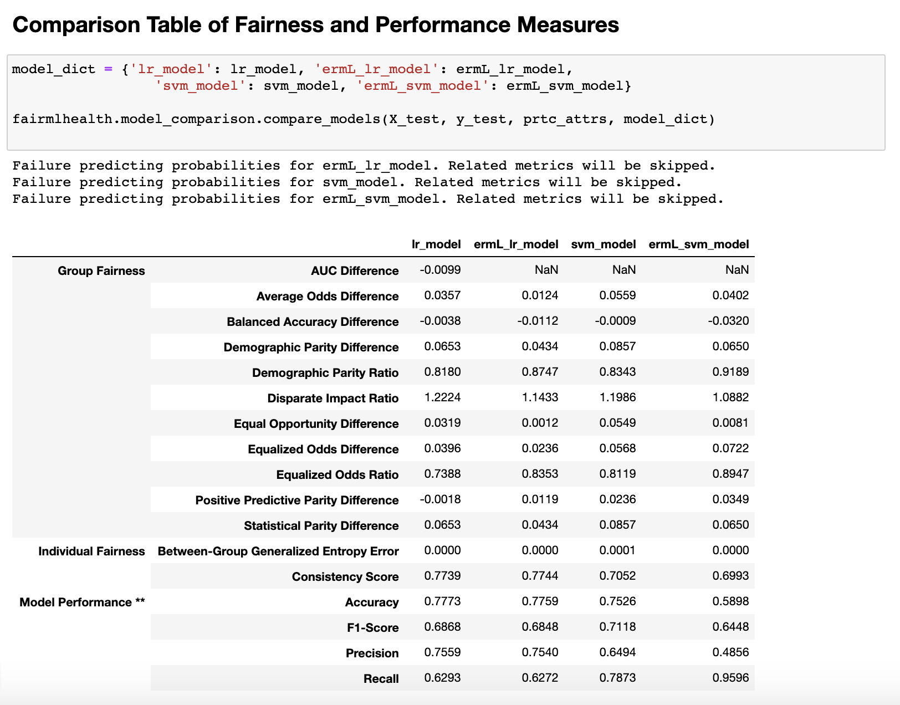
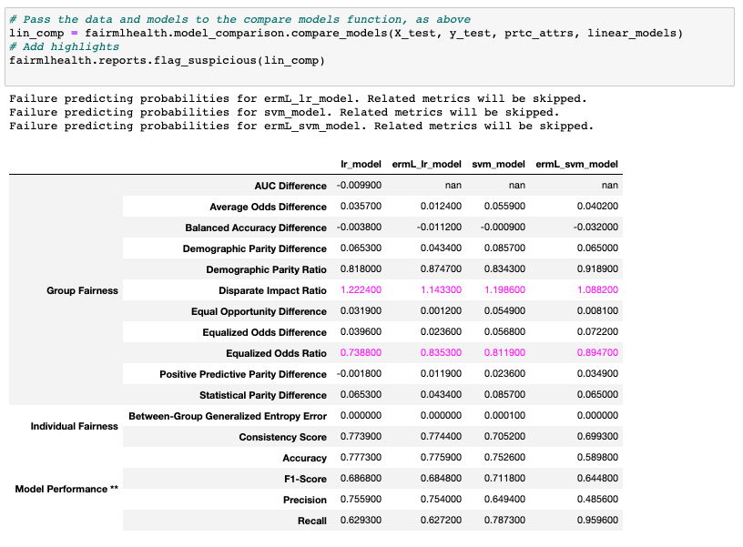

# fairMLHealth
Tools and tutorials for evaluation of fairness and bias in healthcare applications of machine learning models.

## Organization
This library is constructed in three main parts:
- ### [Tools (fairmlhealth)](fairmlhealth/README.md)
    - Methods for generating fairness comparison tables
    - Features used by templates and tutorials to facilitate comparison of multiple metrics

- ### [Templates](templates/README.md)
    - Quickstart notebooks that serve as skeletons for your model analysis

- ### [Tutorias and Examples](tutorials_and_examples/README.md)
    - Tutorials for measuring and analyzing fairness as it applies to machine learning
    - Examples for using the templates and tools

- ### [Publications](publications/README.md)
    - Tutorial presentations, papers, press releases

## Installation
Installing directly from GitHub:

    python -m pip install git+https://https://github.com/KenSciResearch/fairMLHealth

Installing from a local copy of the repo:

    pip install <path_to_fairMLHealth_dir>

## Usage
The primary feature of this library is the model comparison tool, which is most easily accessed through the compare_models function, as shown here.

Note that there are also several useful reporting features, for example the comparison hilighting tool shown below.

