# fairMLHealth
Tools and tutorials for variation analysis in healthcare machine learning.

## New in Version 1.0.0!
We reorganized the library to make things more intuitive and added some useful capabilities:
* Evaluate measures for regression analysis
* Stack stratified tables by cohort groups
* Apply a single **compare** function to evaluate one or multiple models

## Tool Contents
- ### [Documentation and References](./docs/README.md)
    - [Evaluation of Fairness](./docs/resources/Evaluating_Fairness.md)
    - [Quick Reference of Measures](./docs/resources/Measures_QuickReference.md)
    - [References and Resources](./docs/resources/References_and_Resources.md)
    - [Our Publications](./docs/publications/README.md)

- ### [Examples and Tutorials](examples_and_tutorials/README.md)
    - Tutorials for measuring and analyzing fairness as it applies to machine learning
    - Examples for using the templates and tools

- ### [FairMLHealth](fairmlhealth/README.md)
    - **Measure**:
        - Measure healthcare-specific fairness metrics for classification and regression models.
    - **Compare**:
        - Compare protected attributes and other features of a model or several models for potential biases in outcomes.
    - **Visualize**:
        - Visualize biases across multiple models through helpful reports & customizable highlights.

- ### [Templates](templates/README.md)
    - Quickstart notebooks that serve as skeletons for your model analysis

## Installation <a id="installation_instructions"></a>
Installing with pip:

    python -m pip install fairmlhealth

Installing directly from GitHub:

    python -m pip install git+https://github.com/KenSciResearch/fairMLHealth

Installing from a local copy of the repo:

    pip install <path_to_fairMLHealth_dir>

### Troubleshooting Installation Issues

*Trouble with the Installation?*
     - Step 1: Verify that you're using a compatible version of python.
     - Step 2: If step 1 does not resolve your issue, verify that all required packages are properly installed.
     - Step 3: For some metrics, FairMLHealth relies on AIF360, which has a few known installation gotchas. If you are having trouble with your installation, first check [AIF360's Troubleshooting Tips](https://github.com/Trusted-AI/AIF360#troubleshooting).

If you are not able to resolve your issue through the troubleshooting tips above, please let us know through the [Discussion Board](https://github.com/KenSciResearch/fairMLHealth/discussions) or by submitting an issue using the [Issue Template](./docs/code_contributions/ISSUE_TEMPLATE.md) found in our [Documentation folder](./docs/README.md).

## FairMLHealth Usage
Below are some quickstart examples of our most popular features. More information about these and other examples can be found in our [examples_and_tutorials](./examples_and_tutorials) folder! These specific examples are based on our ToolUsage notebooks, for which we've provided online access in Jupyter's nbviewer via the following links:
* [Tool Usage for Binary Classification](https://nbviewer.jupyter.org/github/KenSciResearch/fairMLHealth/blob/master/examples_and_tutorials/Example-ToolUsage_BinaryClassification.ipynb)
* [Tool Usage for Regression](https://nbviewer.jupyter.org/github/KenSciResearch/fairMLHealth/blob/master/examples_and_tutorials/Example-ToolUsage_Regression.ipynb)

Note that while the examples below use pandas, the library is designed to accept either pandas objects or numpy arrays.
### Example Setup

```python
from fairmlhealth import report, measure
import pandas as pd
from sklearn.model_selection import train_test_split
from sklearn.naive_bayes import BernoulliNB
from sklearn.tree import DecisionTreeClassifier


# First we'll create a semi-randomized dataframe with specific columns for our attributes of interest
rng = np.random.RandomState(506)
N = 240
X = pd.DataFrame({'col1': rng.randint(1, 4, N),
                  'col2': rng.randint(1, 75, N),
                  'col3': rng.randint(0, 2, N),
                  'gender': [0, 1]*int(N/2),
                  'ethnicity': [1, 1, 0, 0]*int(N/4),
                  'other': [1, 0, 1, 0, 1, 1, 0, 1]*int(N/8)
                 })
```

### Generalized Reports - report.py
As in previous versions, the latest version of fairMLHealth has tools to create generalized reports of model bias and performance. *An important update starting in Version 1.0.0 is that all of these features are now contained in the **report.py** module (previously named model_comparison.py).*

#### Comparing Binary Classifications
The primary reporting tool is now the **compare** function, which can be used to generate side-by-side comparisons for any number of models, and for either binary classifcation or for regression problems. Model performance metrics such as accuracy and precision (or MAE and RSquared for regression problems) are also provided to facilitate comparison. Below is an example output comparing the two example models defined above.

A flagging protocol is applied by default to highlight any cells with values that are out of range.  This can be turned off by passing ***flag_oor = False*** to report.compare().

``` python

# Ceate a randomized target variable
y = pd.Series(X['col3'].values + rng.randint(0, 2, N), name='Example_Target').clip(upper=1)

# Third, we'll split the data and use it to train two generic models
splits = train_test_split(X, y, stratify=y, test_size=0.5, random_state=60)
X_train, X_test, y_train, y_test = splits

model_1 = BernoulliNB().fit(X_train, y_train)
model_2 = DecisionTreeClassifier().fit(X_train, y_train)

# Generate the report
fairness_measures = report.compare(X_test, y_test, X_test['gender', model_1)

```
Note that the Equal Odds Ratio has been dropped from the example below. This because the false positive rate is approximately zero for both the entire dataset and for the privileged class, leading to a zero in the denominator of the False Positive Rate Ratio. The result is therefore undefined and cannot be compared in the Equal Odds Ratio.

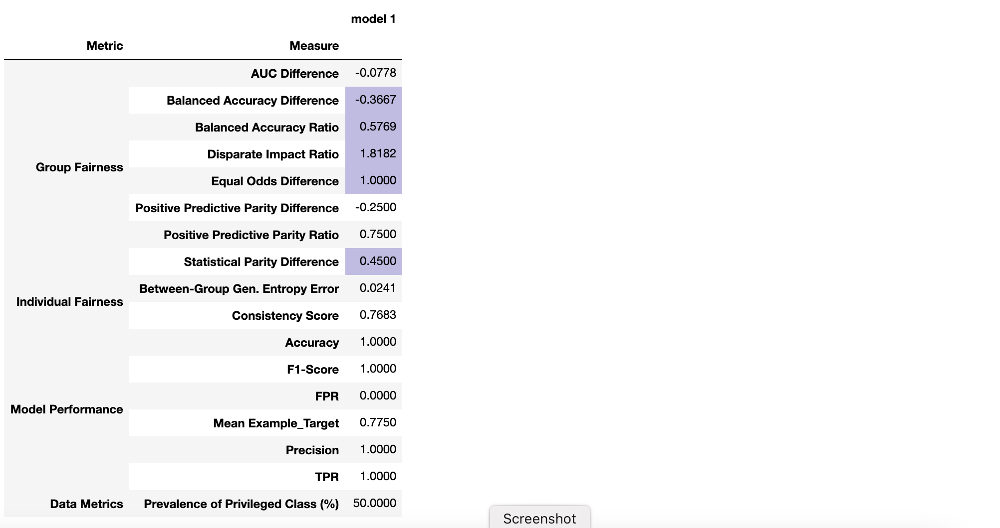


The **compare** tool can also be used to measure two different models or two different protected attributes. Protected attributes are measured separately and cannot yet be combined together with the **compare** tool, although they can be grouped as cohorts in the stratified tables [as shown below](#cohort).


```python
# Example with multiple models
report.compare(test_data = X_test,
               targets = y_test,
               protected_attr = X_test['gender'],
               models = {'Any Name 1':model_1, 'Model 2':model_2})
```
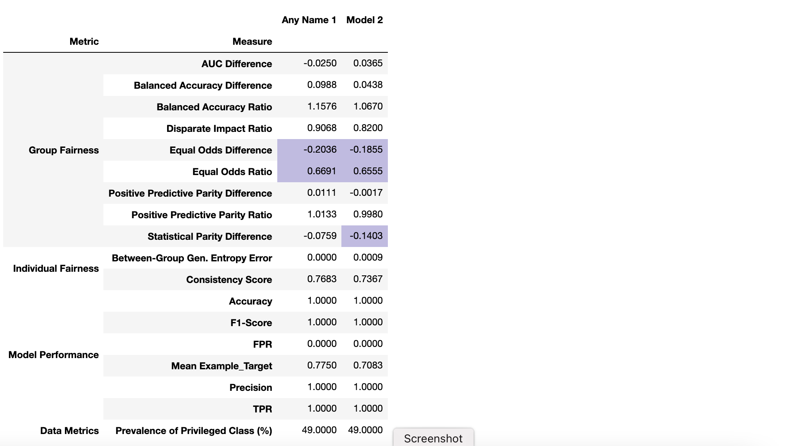

```python
# Example with different protected attributes.
# Note that the same model is passed with two different keys to clarify the column names.
report.compare(X_test, y_test,
               [X_test['gender'], X_test['ethnicity']],
               {'Gender':model_1, 'Ethnicity':model_1})
```
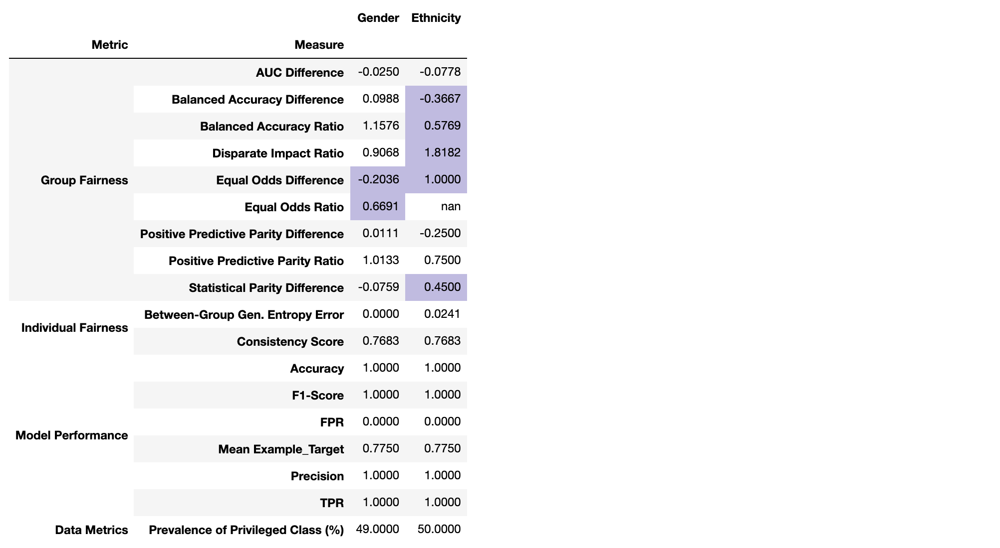

#### Comparing Regressions

Here is an example applying the same function for a regression model. Note that the "fair" range to be used for evaluation of regression metrics does requires judgement on the part of the user. Default ranges have been set to [0.8, 1.2] for ratios, 10% of the available target range for *Mean Prediction Difference*, and 10% of the available MAE range for *MAE Difference*. If the default flags do not meet your needs, they can be turned off by passing ***flag_oor = False*** to report.compare(). More information is available in our [Evaluating Fairness Documentation](./docs/resources/Evaluating_Fairness.md#regression_ranges).

``` python
from sklearn.linear_model import LinearRegression

# Create a randomized target variable. In this case we'll add some correlation with existing variables
y = pd.Series((X['col3']+X['gender']).values + rng.uniform(0, 6, N), name='Example_Continuous_Target')

# Split the data and use it to train a regression model
splits = train_test_split(X, y, test_size=0.5, random_state=42)
X_train, X_test, y_train, y_test = splits
regression_model = LinearRegression().fit(X_train, y_train)

# Generate the report.
# Note that for regression models, the prediction type (pred_type) must be declared as such.
report.compare(X_test, y_test, X_test['gender'], regression_model, pred_type="regression")
```
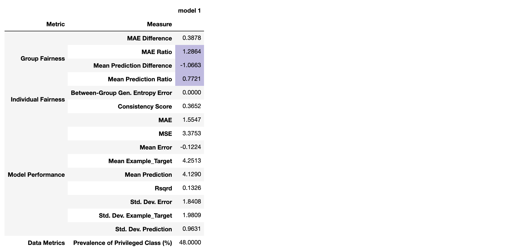

``` python
# Display the same report with no flags and no model performance
report.compare(X_test, y_test, X_test['gender'], regression_model, pred_type="regression",
                flag_oor=False, skip_performance=True))
```
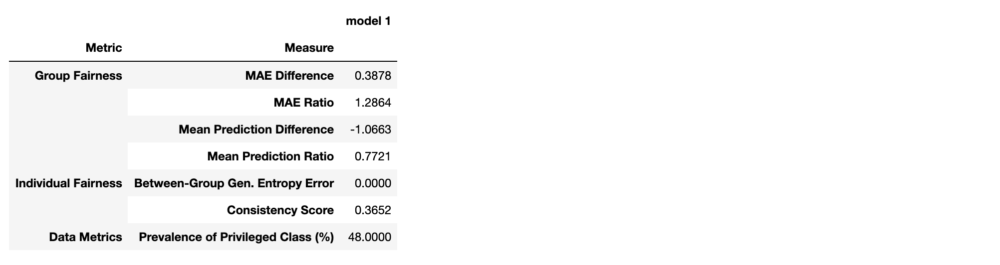


### Detailed Analyses - measure.py

FairMLHealth also provides tools for detailed analysis of model variance by way of stratified data, performance, and bias tables. Beyond evaluating fairness, these tools are intended for flexible use in any generic assessment of model bais to evaluate multiple features at once. *An important update starting in Version 1.0.0 is that all of these features are now contained in the **measure.py** module (previously named reports.py).*

All tables display a summary row for "All Features, All Values". This summary can be turned off by passing ***add_overview=False*** to measure.data().

#### Stratified Data Tables

The stratified data table can be used to evaluate data against one or multiple targets. Two methods are available for identifying which features to assess, as shown in the first example below.

```python
# The following two function calls will produce the same output table shown below

# Arguments Option 1: pass full set of data, subsetting with *features* argument
measure.data(X_test, y_test, features=['gender'])

# Arguments Option 2: pass the data subset of interest without using the *features* argument
measure.data(X_test[['gender']], y_test)

```
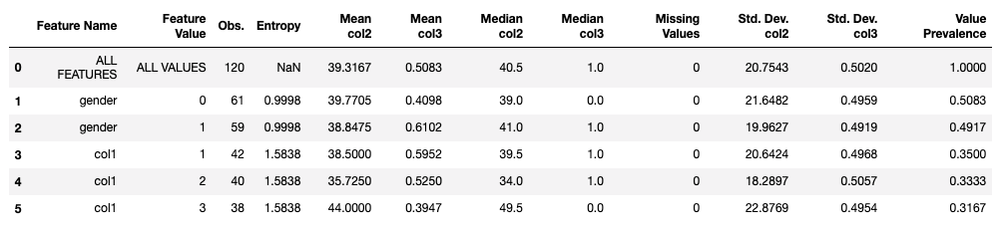

```python
# Display a similar report for multiple targets, dropping the summary row
measure.data(X=X_test, # used to define rows
             Y=X_test, # used to define columns
             features=['gender', 'col1'], # optional subset of X
             targets=['col2', 'col3'], # optional subset of Y
             add_overview=False # turns off "All Features, All Values" row
             )

```
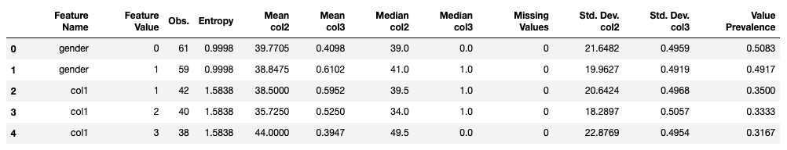

#### Stratified Performance Tables

The stratified performance table evaluates model performance specific to each feature-value subset. These tables are compatible with both classification and regression models. For classification models with the *predict_proba()* method, additional ROC_AUC and PR_AUC values will be included if possible.

```python
# Binary classification performance table with probabilities included
measure.performance(X_test[['gender']],
                    y_true=y_test,
                    y_pred=model_1.predict(X_test),
                    y_prob=model_1.predict_proba(X_test)[:,1])
```
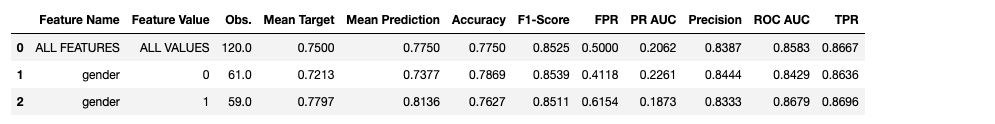

```python
# Regression example
measure.performance(X_test[['gender']],
                    y_true=y_test,
                    y_pred=regression_model.predict(X_test),
                    pred_type="regression")
```
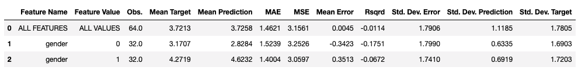

#### Stratified Bias Tables

The stratified bias analysis table apply fairness-related metrics for each feature-value pair. It assumes a given feature-value as the "privileged" group relative to all other possible values for the feature. For example, row **2** in the table below displays measures for **"col1"** with a value of **"2"**. For this row, "2" is considered to be the privileged group, while all other non-null values (namely "1" and "3") are considered unprivileged.

To simplify the table, fairness measures have been reduced to their component parts. For example, the Equal Odds Ratio has been reduced to the True Positive Rate (TPR) Ratio and False Positive Rate (FPR) Ratio.

```python
# Binary classification example
# Note that flag_oor is set to False by default for this feature
measure.bias(X_test[['gender', 'col1']], y_test, model_1.predict(X_test))
```
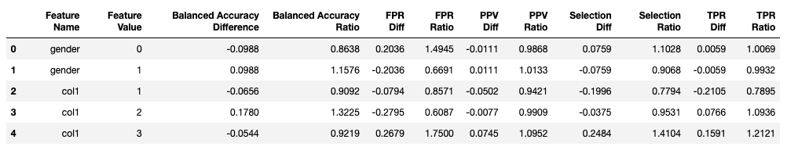

Note that the *flag* function is compatible with both **measure.bias()** and **measure.summary()** (which is demonstrated in the next section). However, to enable colored cells the tool returns a pandas Styler rather than a DataTable. For this reason, *flag_oor* is set to False by default (as shown in the example above). Flagging can be turned on by passing *flag_oor=True* to either function. As an added feature, optional custom ranges can be passed to either **measure.bias()** or **measure.summary()** to facilitate regression evaluation, shown in the example below.

```python
# Custom "fair" ranges may be passed as dictionaries of tuples whose keys are case-insensive measure names
my_ranges = {'MAE Difference':(-0.1, 0.1),  'mean prediction difference':(-2, 2)}

# Note that flag_oor is set to False by default for this feature
measure.bias(X_test[['gender', 'col1']],
             y_test,
             regression_model.predict(X_test),
             pred_type="regression",
             flag_oor=True,
             custom_ranges=my_ranges)
```
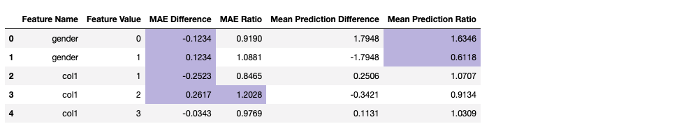


#### Summary Table

The **measure** module also contains a summary function that works similarly to report.compare(). While it can only be applied to one model at a time, it can accept custom "fair" ranges, and accept cohort groups as will be [shown in the next section](#cohort).
```python
# Example summary output for the regression model with custom ranges
measure.summary(X_test[['gender', 'col1']],
                y_test,
                regression_model.predict(X_test),
                prtc_attr=X_test['gender'],
                pred_type="regression",
                flag_oor=True,
                custom_ranges={ 'mean prediction difference':(-0.5, 2)})
```
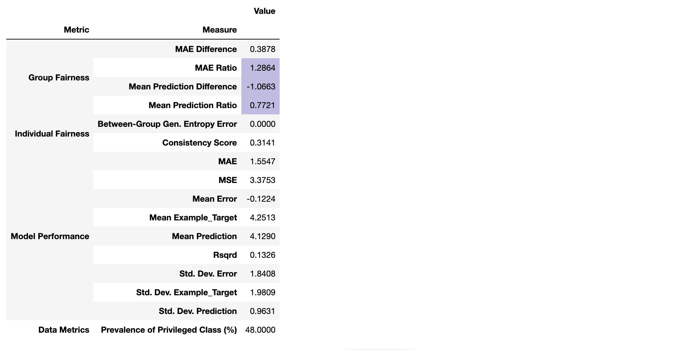

#### <a name="cohort"></a>Analysis by Cohorts

All of the tables generated by measure.py can be passed an optional *cohort_labels* argument specifying additional labels for each observation by which the analysis should be grouped. Cohorts for which there is insufficient data to run the analysis are simply skipped.


```python
# Example of cohorts applied to bias function
cohort_labels = X_test['gender']
measure.bias(X_test['col3'], y_test, model_1.predict(X_test),
                    flag_oor=True, cohort_labels=cohort_labels)
```
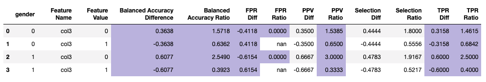

```python
# Example of cohorts applied to summary function
# Note that performance measures and flagging are turned off
measure.summary(X_test[['col2']],
                y_test,
                model_1.predict(X_test),
                prtc_attr=X_test['gender'],
                pred_type="classification",
                flag_oor=False,
                skip_performance=True,
                cohort_labels=X_test[['ethnicity', 'col3']]
               )
```
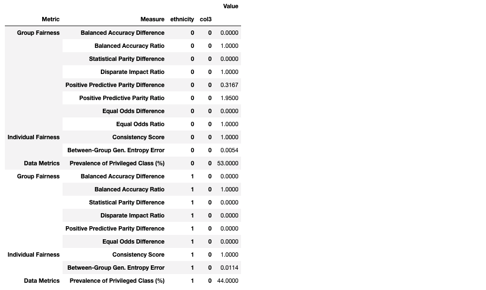


## Additional Library Resources
More information about these and other examples can be found in our [examples_and_tutorials](./examples_and_tutorials) folder! These specific examples are based on our ToolUsage notebooks, for which we've provided online access in Jupyter's nbviewer via the following links:
* [Tool Usage for Binary Classification](./examples_and_tutorials/Example-ToolUsage_BinaryClassification.ipynb)
* [Tool Usage for Regression](./examples_and_tutorials/Example-ToolUsage_Regression.ipynb)

For a deep discussion of fairness evaluation, see [Evaluating Fairness](./docs/resources/Evaluating_Fairness.md) in our [documentation and resources](./docs/resources) section. In the same folder you'll find a [Measures QuickReference](./docs/resources/Measures_QuickReference.md), plus additional [References and Resources](./docs/resources/References_and_Resources.md)

For an active notebook demonstrating the fairness evaluation process, see the [Tutorial for Evaluating Fairness in Binary Classification](https://nbviewer.jupyter.org/github/KenSciResearch/fairMLHealth/blob/master/examples_and_tutorials/Tutorial-EvaluatingFairnessInBinaryClassification.ipynb) and [Tutorial for Evaluating Fairness in Regression](https://nbviewer.jupyter.org/github/KenSciResearch/fairMLHealth/blob/master/examples_and_tutorials/Tutorial-EvaluatingFairnessInRegression.ipynb) (nbviewer links), the notebooks for which are located in our [examples_and_tutorials](./examples_and_tutorials). These are best used with our [ICHI2021 FairnessInHealthcareML Slides.pdf](./docs/publications/ICHI2021-FairnessInHealthcareML-Slides.pdf), which can be found in the [Publications]((./docs/publications/) folder.

Templates are available in the [templates folder](./templates):
* [Binary Classification Assessment Template](./templates/Template-BinaryClassificationAssessment.ipynb)
* [Regression Assessment Template](./templates/Template-RegressionAssessment.ipynb)


## Connect with Us!
This is a work in progress. By making this information as accessible as possible, we hope to promote an industry based on equity and empathy. But building that industry takes time, and it takes the support of the community. Please connect with us so that we can support each other to advance machine learning and healthcare!

- For problems with the source code or documentation, please submit inquiries using our [Issue Template](./docs/code_contributions/ISSUE_TEMPLATE.md) or [Feature Request Template](./docs/code_contributions/FEATURE_REQUEST.md) through GitHub's [Issue Tracker](https://github.com/KenSciResearch/fairMLHealth/issues).
- Other comments, ideas, inquiries, suggestions, feedback and requests are welcome through the [Discussion Page](https://github.com/KenSciResearch/fairMLHealth/discussions).
- See the [Contributing Guidelines](./docs/code_contributions/CONTRIBUTING.md) for more information.

## Citations
### Repository
Allen,  C.,  Ahmad,  M.A., Eckert, C.,  Hu,  J.,   Kumar,  V. , & Teredesai, A. (2020). _fairML-Health: Tools and tutorials for fairness evaluation in healthcare machine learning._ https://github.com/KenSciResearch/fairMLHealth.
```
@misc{fairMLHealth,
    title={fairMLHealth: Tools and tutorials for fairness evaluation in healthcare machine learning.},
    author={Allen, C. and Ahmad, M.A. and Eckert, C. and Hu, J. and Kumar, V. and Teredesai, A.},
    year={2020},
    publisher = {GitHub},
    journal = {GitHub repository},
    howpublished = {\url{https://github.com/KenSciResearch/fairMLHealth}}
}
```

### KDD2020 Tutorial Presentation
Ahmad, M.A., Patel, A., Eckert, C., Kumar, V., Allen, C. & Teredesai, A. (2020, August). [Fairness in Machine Learning for Healthcare.](./docs/publications/KDD2020-FairnessInHealthcareML-Slides.pdf) In _Proceedings of the 26th ACM SIGKDD International Conference on Knowledge Discovery & Data Mining_ (pp. 3529-3530).

See also: [Publications](./docs/publications)

```
@incollection{FMLH_KDD2020,
    title = {Fairness in Machine Learning for Healthcare},
    author = {Ahmad, M.A. and Eckert, C. and Kumar, V. and Patel, A. and Allen, C. and Teredesai, A.},
    year = 2020,
    month = {August},
    booktitle = {Proceedings of the 26th ACM SIGKDD International Conference on Knowledge Discovery & Data Mining},
    pages = {3529--3530}
}
```

### Courses that use FairMLHealth
* BEE 520: *Predictive Learning From Data* Winter 2022 Department of Electrical Engineering, University of Washington Bothell
* CSS 581: *Machine Learning* Autumn 2021 Department of Computer Science, University of Washington Bothell
* TCSS 593: *Research Seminar In Data Science* Spring 2021 Department of Computer Science, University of Washington Tacoma
* BEE 520: *Predictive Learning From Data* Spring 2021 Department of Electrical Engineering, University of Washington Bothell
* CSS 581: *Machine Learning* Autumn 2020 Department of Computer Science, University of Washington Bothell

## Key Contributors
* [Muhammad Aurangzeb Ahmad](http://www.aurumahmad.com)
* [Christine Allen](https://github.com/camagallen)
* Carly Eckert
* [Juhua Hu](http://faculty.washington.edu/juhuah/)
* Vikas Kumar
* Arpit Patel
* [Ankur Teredesai](https://faculty.washington.edu/ankurt/)
