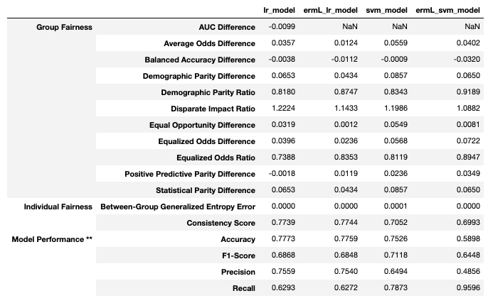
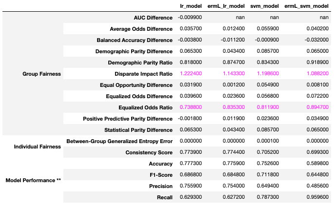

# fairMLHealth
Tools and tutorials for evaluation of fairness and bias in healthcare applications of machine learning models.


## Organization
This library is constructed in three main parts:
- ### [Tools (fairmlhealth)](fairmlhealth/README.md)
    - Methods for generating fairness comparison tables
    - Features used by templates and tutorials to facilitate comparison of multiple metrics

- ### [Templates](templates/README.md)
    - Quickstart notebooks that serve as skeletons for your model analysis

- ### [Tutorias and Examples](tutorials_and_examples/README.md)
    - Tutorials for measuring and analyzing fairness as it applies to machine learning
    - Examples for using the templates and tools

- ### [Publications](publications/README.md)
    - Tutorial presentations, papers, press releases


## Installation
Installing directly from GitHub:

    python -m pip install git+https://https://github.com/KenSciResearch/fairMLHealth

Installing from a local copy of the repo:

    pip install <path_to_fairMLHealth_dir>


## Usage
The primary feature of this library is the model comparison tool. The current version supports assessment of binary prediction models through use of the compare_models function.

```python
# Load Data
X_test, y_test = loaded_data  ## generated above
prtc_attr = X_test['PROTECTED_ATTRIBUTE']
# Specify either a dict or a list of trained models to compare
model_dict = {'lr_model': lr_model, 'ermL_lr_model': ermL_lr_model,
                 'svm_model': svm_model, 'ermL_svm_model': ermL_svm_model}
# Pass the above to the compare models function
fairmlhealth.model_comparison.compare_models(X_test, y_test, prtc_attr, model_dict)

```


Notice above that for any models that do not have prediction probabilities the tool simply adds a NaN value for measures.


There are also several useful reporting features, for example the comparison highlighting tool shown below.
```python
# Pass the data and models to the compare models function, as above
lin_comp = fairmlhealth.model_comparison.compare_models(X_test, y_test, prtc_attrs, linear_models)
# Add highlights
fairmlhealth.reports.flag_suspicious(lin_comp)

```



## Citation
@misc{fairMLHealth, \
  title={{fairMLHealth: Tools and tutorials for evaluation of fairness and bias in healthcare applications of machine learning models.
}}, \
  author={Allen, Christine and Ahmad, Muhammad and Kumar, Vikas}, \
  year={2020}, \
  publisher = {GitHub}, \
  journal = {GitHub repository}, \
  howpublished = {\url{https://github.com/KenSciResearch/fairMLHealth}} \
}


## Key Contributors
* Muhammad A. Ahmad
* Christine Allen
* Juhua Hu
* Vikas Kumar

