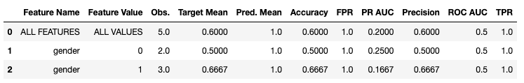

# fairMLHealth
Tools and tutorials for evaluation of fairness and bias in healthcare applications of machine learning models.


## Resources
- ### [Documentation and References](docs/README.md)
    - [Evaluation of Fairness](docs/resources/Evaluating_Fairness.md)
    - [Our Publications](docs/publications/README.md)
    - [References and Resources](docs/resources/References_and_Resources.md)
    - [Summary Tables (Quick Reference of Measures)](docs/resources/Measures_QuickReference.md)

- ### [Examples and Tutorials](examples_and_tutorials/README.md)
    - Tutorials for measuring and analyzing fairness as it applies to machine learning
    - Examples for using the templates and tools

- ### [FairMLHealth](fairmlhealth/README.md)
    - **Analyze**:
        - Tools for data and model validation
        - Tools for detailed analysis across multiple indicators (e.g. when location of bias is undetermined)
    - **Report**:
        - Tools stylized for inclusion in publications and analytical reports
        - Tools for monitoring and reporting on operationalized models
    - **Supplement**:
        - Generalized tools that can be used in bias analysis as well as in other applications

- ### [Templates](templates/README.md)
    - Quickstart notebooks that serve as skeletons for your model analysis

## Installation <a id="installation_instructions"></a>
Installing directly from GitHub:

    python -m pip install git+https://github.com/KenSciResearch/fairMLHealth

Installing from a local copy of the repo:

    pip install <path_to_fairMLHealth_dir>

### Troubleshooting
For some metrics, FairMLHealth relies on AIF360, which has a few known installation gotchas. If you are having trouble with your installation, first check [AIF360's Troubleshooting Tips](https://github.com/Trusted-AI/AIF360#troubleshooting).

If you are not able to resolve your issue through these troubleshooting tips, please let us know through the [Discussion Board](https://github.com/KenSciResearch/fairMLHealth/discussions) or by submitting an issue using the [Issue Template](docs/code_contributions/ISSUE_TEMPLATE.md) found in our [Documentation folder](docs/README.md).

## FairMLHealth Usage
For a functioning notebook of the usage examples below, see [Example-ToolUsage](./examples_and_tutorials/Example-ToolUSAGE.ipynb)
### Example Setup
The primary feature of this library is the model comparison tool. The current version supports assessment of binary prediction models through use of the compare_measures function.

```python
from fairmlhealth import report as fhrp, measure
import pandas as pd
from sklearn.model_selection import train_test_split
from sklearn.naive_bayes import BernoulliNB
from sklearn.tree import DecisionTreeClassifier


# Load data
X = pd.DataFrame({'col1':[1,2,50,3,45,32],
                  'col2':[34,26,44,2,1,1],
                  'col3':[32,23,34,22,65,27],
                  'gender':[0,1,0,1,1,0]
                  })
y = pd.Series([1,1,0,1,0,1], name='y')
X_train, X_test, y_train, y_test = train_test_split(X, y, test_size=0.75, random_state=36)

#Train models
model_1 = BernoulliNB().fit(X_train, y_train)
model_2 = DecisionTreeClassifier().fit(X_train, y_train)

# Determine your set of protected attributes
prtc_attr = X_test['gender']

# Specify either a dict or a list of trained models to compare
model_dict = {'model_1': model_1, 'model_2': model_2}
```

### Measuring
The primary feature of this library is the model comparison tool. The current version supports assessment of binary prediction models through use of the measure_models and compare_models functions.

Measure_model is designed to generate an analysis table of multiple fairness metrics for a single model. Here it is shown wrapped in a "flag" function to emphasize values that are outside of the "fair" range.

``` python
# Generate a pandas dataframe of measures
fairness_measures = fhrp.measure_model(X_test, y_test, prtc_attr, model_1)
# Display and color measures that are out of range
measure.flag(fairness_measures)
```


### Evaluating

FairMLHealth now also includes stratified table features to aid in identifying the source of unfairness or other bias: a data table, performance table, and bias table. Note that these stratified tables can evaluate multiple features at once, and that there are two options for identifying which features to assess.

Note that the flag tool has not yet been updated to work with stratified tables.

#### Stratified Data Tables

The data analysis table is shown below with each of the two data argument options. It evaluates basic statistics specific to each feature-value, in addition to relative statistics for the target value.

```python
# Arguments Option 1: pass full set of data, subsetting with *features* argument
measure.data(X_test, y_test, features=['gender'])

# Arguments Option 2: pass the data subset of interest without using the *features* argument
measure.data(X_test[['gender']], y_test)
```


### Stratified Performance Tables

The stratified performance analysis table evaluates model performance specific to each feature-value subset. If prediction probabilities (via the *predict_proba()* method) are available to the model, additional ROC_AUC and PR_AUC values will be included.

```python
measure.performance(X_test[['gender']], y_test, model_1.predict(X_test))
```



#### Stratified Bias Fairness Tables

The stratified bias analysis table evaluates model fairness specific to each feature-value subset. It assumes each feature-value as the "privileged" group relative to all other possible values for the feature. For example, row 3 in the table below displaying measures of "col1" value of "2" where 2 is considered to be the privileged group and all other values (1, 2, 45, and 50) are considered unprivileged.

To simplify the table, fairness measures have been reduced to their component parts. For example, measures of Equalized Odds can be determined by combining the True Positive Rate (TPR) Ratios & Differences with False Positive Rate (FPR) Ratios & Differences.

See also: [Fairness Quick References](../docs/Fairness_Quick_References.pdf) and the [Tutorial for Evaluating Fairness in Binary Classification](./Tutorial-EvaluatingFairnessInBinaryClassification.ipynb)

```python
measure.bias(X_test[['gender', 'col1']], y_test, model_1.predict(X_test))
```


### Comparing Results for Multiple Models

The compare_models feature can be used to generate side-by-side fairness comparisons of multiple models. Model performance metrics such as accuracy and precision are also provided to facilitate comparison.

Below is an example output comparing the two example models defined above. Missing values have been added for metrics requiring prediction probabilities (which the second model does not have).

```python
comparison = fhrp.compare_models(X_test, y_test, prtc_attr, model_dict)
measure.flag(comparison)
```


The compare_models function can also be used to measure two different protected attributes. Protected attributes are measured separately and cannot yet be combined together with this tool.

```python
fhrp.compare_models(X_test, y_test,
                     [X_test['gender'], X_test['ethnicity']],
                      {'gender':model_1, 'ethnicity':model_1})
```


### Other Examples
For a more detailed example of how to use this package, please see the [Example Binary Classification Assessment](./examples_and_tutorials/ Example-BinaryClassificationTemplate.ipynb) and the the [Tutorial for Evaluating Fairness in Binary Classification](./Tutorial-EvaluatingFairnessInBinaryClassification.ipynb).


## Connect with Us!
This is a work in progress. By making this information as accessible as possible, we hope to promote an industry based on equity and empathy. But building that industry takes time, and it takes the support of the community. Please connect with us so that we can support each other to advance machine learning and healthcare!

- For problems with the source code or documentation, please submit inquiries using our [Issue Template](docs/code_contributions/ISSUE_TEMPLATE.md) or [Feature Request Template](docs/code_contributions/FEATURE_REQUEST.md) through GitHub's [Issue Tracker](https://github.com/KenSciResearch/fairMLHealth/issues).
- Other comments, ideas, inquiries, suggestions, feedback and requests are welcome through the [Discussion Page](https://github.com/KenSciResearch/fairMLHealth/discussions).
- See the [Contributing Guidelines](docs/code_contributions/CONTRIBUTING.md) for more information.

## Citations
### Repository
Allen,  C.,  Ahmad,  C.,  Muhammad  Eckert,  Hu,  J.,  &  Kumar,  V. (2020). _fairML-Health: Tools and tutorials for evaluation of fairness and bias in healthcare applications of machine learning models._ https://github.com/KenSciResearch/fairMLHealth.
```
@misc{fairMLHealth,
    title={{fairMLHealth: Tools and tutorials for evaluation of fairness and bias in healthcare applications of machine learning models.}},
    author={Allen, Christine and Ahmad, Muhammad Eckert, Carly and Hu, Juhua and Kumar, Vikas},
    year={2020},
    publisher = {GitHub},
    journal = {GitHub repository},
    howpublished = {\url{https://github.com/KenSciResearch/fairMLHealth}}
}
```

### KDD Tutorial Presentation
Ahmad, M. A., Patel, A., Eckert, C., Kumar, V., & Teredesai, A. (2020, August). [Fairness in Machine Learning for Healthcare.](./docs/publications/KDD2020-FairnessInHealthcareML-Slides.pptx) In _Proceedings of the 26th ACM SIGKDD International Conference on Knowledge Discovery & Data Mining_ (pp. 3529-3530).

See also: [Publications](./docs/publications)

```
@incollection{APEKT_KDD2020,
    title = {Fairness in Machine Learning for Healthcare},
    author = {Ahmad, MA. and Eckert, C. and Kumar, V. and Patel, A. and Teredesai, A.},
    year = 2020,
    month = {August},
    booktitle = {Proceedings of the 26th ACM SIGKDD International Conference on Knowledge Discovery & Data Mining},
    pages = {3529--3530}
}
```

### Courses that use FairMLHealth
* TCSS 593: *Research Seminar In Data Science* Spring 2021 Department of Computer Science, University of Washington Tacoma
* EE 520: *Predictive Learning From Data Spring 2021* Department of Electrical Engineering, University of Washington Bothell
* CSS 581: *Machine Learning Autumn 2020* Department of Computer Science, University of Washington Bothell

## Key Contributors
* [Muhammad Aurangzeb Ahmad](http://www.aurumahmad.com)
* Christine Allen
* Carly Eckert
* Juhua Hu
* Vikas Kumar
* Arpit Patel
* Ankur Teredesai
