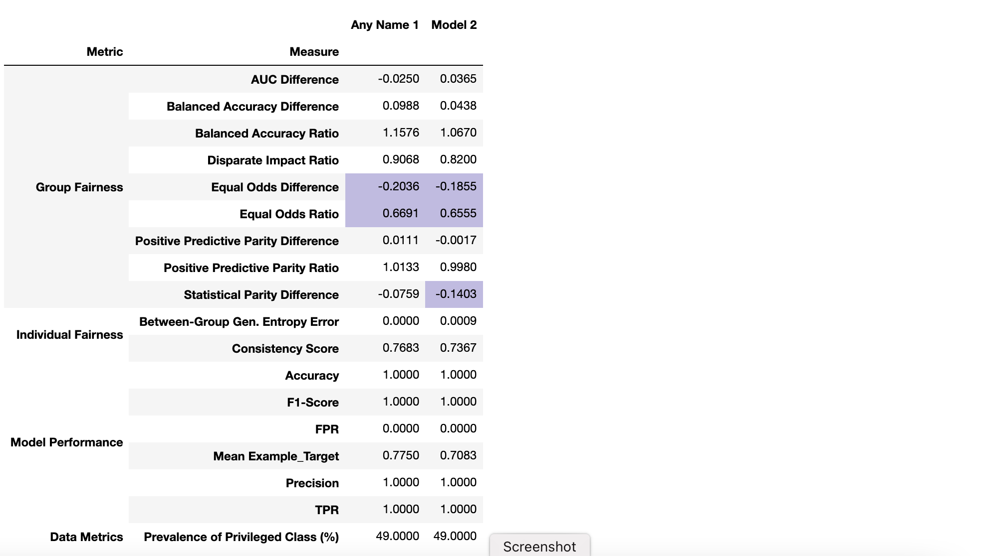

# Evaluating Fairness in Machine Learning
by Christine Allen

## About
This reference introduces concepts, methods, and libraries for measuring fairness in ML as it relates to problems in healthcare. This is a revamped version of the tutorial presented at the [KDD 2020 Tutorial on Fairness in Machine Learning for Healthcare](../publications/KDD2020-FairnessInHealthcareML-Slides.pptx).

There are abundant other publications covering the theoretical basis for fairness metrics, with many online and academic resources covering the details of specific fairness measures (See [References (bottom)](#references) and [Additional Resources (bottom)](#additional_resources), or [Our Resources Page](../resources/Measures_QuickReference.md)). Many of these excellent references fall short of discussing edge cases as well as the practical and philosophical considerations when evaluating real models for real customers. Here we attempt to bridge this gap.

## Contents
[Part 1](#part1) - Framing the Problem
  * Background: Disparity & Harms

[Part 2](#part2) - Defining and Measuring Fairness (in Python)
  * Metrics of Fairness
  * Example Model
  * Group Fairness Measures
  * Individual Fairness Measures

[Part 3](#part3) - Comparing Models and Mitigating Disparity
  * Choosing Appropriate Measure(s)
  * Comparing Models
  * Fairness-Aware ML Algorithms

[Part 4](#part4) - Conclusion
  * How Fair is Fair Enough?

----
# Framing the Problem 

## Context
In issues of social justice, *discrimination* refers to the unjustified, differential treatment of individuals based on their sociodemographic status [[Romei and Ruggieri 2014]](#romei2014_ref). The "socially salient" sociodemographic groups [[Speicher 2018]](#speicher2018_ref) against which discrimination is measured are known as ***protected attributes***, *sensitive attributes*, or *protected features*. Therefore, the goal of our work is to evaluate (a) whether our model makes similar predictions for all socially salient groups, or (b) whether any differences arise that are ethically justified.

## Disparity  

The word *discrimination* typically evokes direct or deliberate action to disadvantage one race, religion, or ethnicity. This kind of disparity is known as *disparate treatment*. However, a more insidious form of discrimination can occur when ostensibly unbiased practices result in the – perhaps unconscious – unfair treatment of a socially disadvantaged group. This is known as *disparate impact*.

Disparate impact in a machine learning model originates from bias in either the data or the algorithms. A popular example is the prejudicially biased data used for recidivism prediction. Due to disparate socioeconomic factors and systemic racism in the United States, blacks have historically been (and continue to be) incarcerated at higher rates than whites [[NAACP]](#naacp). Not coincidentally, blacks are also exonerated due to wrongful accusation at a considerably higher rate than whites [[NAACP]](#naacp). A recidivism model that fails to adjust for circumstances such as these will predict a higher rate of recidivism among blacks.

Machine learning models can also be a source of disparate impact in their implementation, through unconscious human biases that affect the fair interpretation or use of the model's results. This reference does not cover measurement of fairness at implementation. However, if you are interested in fair implementation, we recommend looking at Google's [Fairness Indicators](https://www.tensorflow.org/tfx/guide/fairness_indicators).

## Harms

In evaluating the potential impact of an ML model, it can be helpful to first clarify what specific harm(s) can be caused by the model's failures. In the context of fairness, machine learning "harms" are commonly observed to fall into one of two categories.

* **Allocative Harm:** promoting unfair allocation of finite resources
  * Examples include:
    * an employment service presenting certain jobs to only males and not females
    * denying loans to the elderly or disabled
* **Representational Harm:** promoting the continued marginalization of some groups
  * Examples include:
    * Quality of Service: allocating higher insurance payouts for males than for females
    * Stereotyping: service more likely to show advertising for bail bonds to dark skinned men
    * Under-Representation: image search for "doctor" returning mostly images of white men
    * Recognition: facial recognition mistakenly and offensively labeling a person as an animal

References:
[The Trouble with Bias](https://youtu.be/fMym_BKWQzk) Kate Crawford, NIPS2017

----
# Defining and Measuring Fairness 

The following section defines common fairness measures that are used elsewhere. Skip ahead to [Part 3](#part3) for an example of how these measures are applied.

### [Convenient Charts of Fairness Measures](Measures_QuickReference.md)

## Metrics of Fairness  

Three metric categories are commonly used for determining whether a model is considered "fair": (1) Group Fairness, which compares the statistical similarities of predictions relative to known and discrete protected groupings; (2) Similarity-Based Measures, which evaluate predictions without those discrete protected groups; and (3) Causal Reasoning measures, which evaluate fairness through the use of causal models.

### Statistical Definitions of Group Fairness

|**Metric** |**Criteria** |**Definition** |**Description** |
|-- |-- |-- |-- |
|Demographic Parity |Statistical Independence |  | Sensitive attributes (A) are statistically independent of the prediction result (R) |
|Equalized Odds | Statistical Separation |  | Sensitive attributes (A) are statistically independent of the prediction result (R) given the ground truth (Y) |
|Predictive Parity |Statistical Sufficiency |  | Sensitive attributes (A) are statistically independent of the ground truth (Y) given the prediction (R) |

From: [Verma & Rubin, 2018](#vermarubin)

## Fairness Measures

|**Name** |**Definition** |**About** |**Aliases** |
|------|------|------|------|
|**Demographic Parity** |  |Predictions must be statistically independent from the sensitive attributes. Subjects in all groups should have equal probability of being assigned to the positive class. Note: may fail if the distribution of the ground truth justifiably differs among groups  Criteria: Statistical Independence |Statistical Parity, Equal Acceptance Rate, Benchmarking |
|**Conditional Statistical Parity** | | Subjects in all groups should have equal probability of being assigned to the positive class conditional upon legitimate factors (L).  Criteria: Statistical Separation |&nbsp; |
|**False positive error rate (FPR) balance** | |Equal probabilities for subjects in the negative class to have positive predictions.   Mathematically equivalent to equal TNR:      Criteria: Statistical Separation | Predictive Equality |
|**False negative error rate (FNR) balance**|  | Equal probabilities for subjects in the positive class to have negative predictions.   Mathematically equivalent to equal TPR:     Criteria: Statistical Separation | Equal Opportunity |
|**Equalized Odds**|  | Equal TPR and equal FPR. Mathematically equivalent to the conjunction of FPR balance and FNR balance  Criteria: Statistical Separation|  Disparate mistreatment, Conditional procedure accuracy equality |
|**Predictive Parity**|  | All groups have equal PPV (probability that a subject with a positive prediction actually belongs to the positive class.   Mathematically equivalent to equal False Discovery Rate (FDR):      Criteria: Statistical Sufficiency |Outcome Test |
|**Conditional use accuracy equality**|   | Criteria: Statistical Sufficiency | &nbsp; |
|**Overall Accuracy Equity**|  |Use when True Negatives are as desirable as True Positives |&nbsp; |
|**Treatment Equality**|  | Groups have equal ratios of False Negative Rates to False Positive Rates |&nbsp; |
|**Calibration**|  | For a predicted probability score S, both groups should have equal probability of belonging to the positive class  Criteria: Statistical Sufficiency |Test-fairness, matching conditional frequencies |
|**Well-calibration**|  | For a predicted probability score S, both groups should have equal probability of belonging to the positive class, and this probability is equal to S  Criteria: Statistical Sufficiency |&nbsp; |
|**Balance for positive class**|  | Subjects in the positive class for all groups have equal average predicted probability score S  Criteria: Statistical Separation |&nbsp; |
|**Balance for negative class**|  | Subjects in the negative class for all groups have equal average predicted probability score S  Criteria: Statistical Separation |&nbsp; |
||||||
|**Causal discrimination**|  | Same classification produced for any two subjects with the exact same attributes |&nbsp; |
|**Fairness through unawareness**|  | No sensitive attributes are explicitly used in the decision-making process  Criteria: Unawareness | &nbsp; |
|**Fairness through awareness (Individual Fairness)**| for a set of applicants V , a distance metric between applicants k : V Å~V → R, a mapping from a set of applicants to probability distributions over outcomes M : V → δA, and a distance D metric between distribution of outputs, fairness is achieved iff  | Similar individuals (as defined by some distance metric) should have similar classification |Individual Fairness |
|**Counterfactual fairness**| A causal graph is counterfactually fair if the predicted outcome d in the graph does not depend on a descendant of the protected attribute G. |&nbsp; |&nbsp; |
||||||

\* *Note that this reference will not elaborate the details of Counterfactual Fairness since the libraries used do not have built-in functionality for it. For an example of Counterfactual Fairness, see "ThemisML" by [Bantilan (2018)](#bantilan2018_ref).*

## Example Model

For the following explanations of specific measures, we'll use the results of a hypothetical predictive model shown in the table below. Our example shows performance and fairness measures relative to language as a protected attribute (i.e., whether or not a given patient is an English speaker). Also shown are stratified tables that will aid us in better understanding the source of any apparent disparity. Curious readers can walk through the generation of the model and this table of fairness measures in the [Evaluating Fairness in Binary Classification Tutorial Notebook](../examples_and_tutorials/Tutorial-EvaluatingFairnessInBinaryClassification.ipynb).

<h3 style="text-align: center"><u> Example FairMLHealth Fairness Report </u> </h3>

<h3 style="text-align: center"><u> Example FairMLHealth Stratified Data Table </u> </h3>

<h3 style="text-align: center"><u> Example FairMLHealth Stratified Performance Table </u> </h3>

<h3 style="text-align: center"><u> Example FairMLHealth Stratified Fairness Table </u> </h3>

----
## Group Fairness Measures

### Binary Classifcation
#### Demographic Parity  
A model has **Demographic Parity** if the predicted positive rates (selection rates) are approximately the same for all groups of the protected attribute. Two common measures are the Statistical Parity Difference and the Disparate Impact Ratio.

The *Statistical Parity Difference* is the difference in the probability of prediction between the two groups. A difference of 0 indicates that the model is perfectly fair relative to the protected attribute (it favors neither the privileged nor the unprivileged group). Values between -0.1 and 0.1 are considered reasonably fair.
> 

The *Disparate Impact Ratio* is the ratio between the probability of positive prediction for the unprivileged group and the probability of positive prediction for the privileged group. A ratio of 1 indicates that the model is fair relative to the protected attribute (it favors neither the privileged nor the unprivileged group). Values between 0.8 and 1.2 are considered reasonably fair.
> 

#### Equal Odds
Odds are equalized if P(+) is approximately the same for all groups of the protected attribute.

The *Equal Odds Difference* is calculated by this tool as the greater between the difference in TPR and the difference in FPR, where difference is calculated as the unprivileged value minus the privileged value. An Equal Odds Difference of 0 indicates that all groups have the same TPR and FPR, and that the model is within the "fair" range relative to the protected attribute.
> 

The *Equal Odds Ratio* is calculated by this tool as the ratio of maximimum divergence from 1 between the TPR Ratio and FPR Ratio, where the TPR and FPR ratios are calculated as the rate of the unpriviliged group divided by the rate of the privileged group. A value of 1 means that all groups have the same TPR and FPR, and that the model is within the "fair" range relative to the protected attribute.
> 

*Equal Opportunity Difference (or Ratio)* compares only the TPRs (recall scores) between the unprivileged and privileged groups.
> 

#### Measures of Disparate Performance
These measures evaluate whether model performance is similar for all groups of the protected attribute.

The *Positive Predictive Parity Difference (or Ratio)* compares the Positive Predictive Value (PPV, aka. precision), between groups.
> 

The *Balanced Accuracy Difference (or Ratio)* compares the Balanced Accuracy between groups, where balanced accuracy is the mean of the sensitivity and specificity. **Since many models are biased due to data imbalance, this can be an important measure.**
> 

### Regression

Currently available literature has significantly more information, more measures, and more examples for binary classification problems than for regression problems. This is likely for several reasons. For one, binary classification problems are simple. It is often easier to assign "good" verses "bad" outcomes, and thus to define fair predictions. Moreover, in many cases, regression problems can be converted to binary classification problems by using some inherent threshold. For example, in a hypothetical scenario where palliative care is offered to patients for whom their pain score is predicted to be above the 30th percentile, there is a clear demarcation in the distribution of services. However, not all regression problems lead to outcomes with such clear boundaries. The evaluation of results may depend upon other factors beyond the scope of the regression problem. Furthermore, depending upon how scores are used, there may be multiple, if not overlapping, ranges for "good" verses "bad" regression predictions. Lastly, the normalization process for target distributions requires statistical judgement, which impedes the definition of a single metric or set of boundaries applicable to all regressions.

For these reasons, only a few measures are included in the fairMLHealth tool. These were chosen for their likeness to well-known measures of fair classification. The "fair" range to be used for these metrics requires judgement on the part of the analyst. Default ranges in fairMLHealth have been set to [0.8, 1.2] for ratios, 10% of the total prediction range for *Mean Prediction Difference*, and 10% of the MAE range for *MAE Difference*.

#### Relative Mean Prediction
The *Mean Prediction Ratio* is the ratio of mean of predicted values for the unprivileged group over the mean of predicted values for privileged group..
> 

The *Mean Prediction Difference* is the difference between the mean prediction of the unprivileged group and the mean prediction of the privileged group.
> 

#### Relative Mean Absolute Error (MAE)
The *MAE Ratio* is the ratio of the ratio of the MAE for the unprivileged group over the MAE of the privileged group.
> 

The *MAE Difference* is the difference of the MAE for the unprivileged group and the MAE of the privileged group.
> 

## Comparing Group Fairness (Statistical) Measures 
The highlighted rows in our example FairMLHealth Fairness Report [above](#fairness_report) indicates that the Disparate Impact ratio is out of range; but what is that range and how is it determined? In 1978, the United States Equal Employment Opportunity Commission adopted the "Four-Fifths Rule", a guideline stating that, "A selection rate for any race, sex, or ethnic group which is less than four-fifths (4/5) (or eighty percent) of the rate for the group with the highest rate will generally be regarded... as evidence of adverse impact."[EOC (1978)](#fourfifths_ref) This rubric has since been adopted for measures of fairness in ML. This translates to a "fair" range of selection rate ratios that are between 0.8 and 1.2.

The four-fifths rule works well when comparing prediction performance metrics whose values are above 0.5. However, the rule fails when comparing small values, as is the case in this example and which is as shown in the example stratified table. The ratios between two such small values can easily be well above 1.2, even though the true difference is only a few percentage points. For this reason it's useful to compare both the ratios and the differences when evaluating group measures.

Returning to the example: the Disparate Impact Ratio and Statistical Parity Difference are two related measures that compare the selection rates between the protected and unprotected groups. Although the Disparate Impact Ratio in our example is outside of the "fair" range for ratios (it's above 1.2), the Statistical Parity Difference is well within range for differences. We can see why more clearly by examining the Stratified Performance Table (also above). Here we see that the selection rates (shown as: "POSITIVE PREDICTION RATES") are actually quite close. The same is true for the Equal Odds Ratio, which also appears outside of the "fair" range. The Equal Odds Difference is actually quite small, which we can understand more clearly by looking at the True Positive Rates and False Positive Rates (shown as TPR and FPR) in the Stratified Table.

Note that the "fair" range to be used for regression metrics does not necessarily follow these rules and will require some judgement on the part of the user, particularly in the evaluation of between-group difference (i.e. *Mean Prediction Difference* and *MAE Difference*).

|Group Measure Type |Examples |"Fair" Range |Favored Group |
|- |- |- |- |
|Statistical Ratio |Disparate Impact Ratio, Equal Odds Ratio | 0.8 <= "Fair" <= 1.2 | < 1 favors privileged group, > 1 favors unprivileged |
|Statistical Difference |Equal Odds Difference, Predictive Parity Difference | -0.1 <= "Fair" <= 0.1 | < 0 favors privileged group, > 0 favors unprivileged |

### Problems with Group Fairness Measures
Although these statistically-based measures make intuitive sense, they are not applicable in every situation. For example, Demographic Parity is inapplicable where the base rates significantly differ between groups. Also, by evaluating protected attributes in pre-defined groups, these measures may miss certain nuance. For example, a model may perform unfairly for certain sub-groups of the unprivileged class (e.g., black females), but not for the unprivileged group as a whole.

### The Impossibility Theorem of Fairness 
Another drawback of these statistically-based measures is that they are mathematically incompatible. No machine learning model can be perfectly fair according to all three metrics at once. People + AI Research (PAIR) posted an [excellent visual explanation of the Impossibility Theorem](https://pair.withgoogle.com/explorables/measuring-fairness/).

----
## Similarity-Based Measures and Individual Fairness
Measures of individual fairness determine if "similar" individuals are likely to have similar predictions. This is independent of any specific protected attribute unless otherwise stated.

### Consistency Scores 
Consistency scores measure the similarity between specific predictions and the predictions of like individuals. They are not specific to a particular attribute, but rather they evaluate the generally equal treatment of equal individuals. In [AIF360](https://github.com/IBM/AIF360), the consistency score is calculated as the compliment of the mean distance to the score of the mean nearest neighbor, using Scikit-Learn's Nearest Neighbors algorithm (default: 5 neighbors determined by the Ball Tree algorithm). For this measure, values closer to 1 indicate greater consistency, and those closer to zero indicate less consistency. More information about consistency scores is available in [[Zemel (2013)]](#zemel2013_ref).
> 

### The Generalized Entropy Index and Related Measures
The *Generalized Entropy (GE) Index* was proposed as a metric for income inequality [[Shorrocks (1980)]](#shorrocks_ref)), although it originated as a measure of redundancy in information theory. In 2018, [Speicher *et al.*](#speicher2018_ref) proposed its use for ML models. These measures are dimensionless, and therefore are most useful in comparison relative to each other. Values closer to zero indicate greater fairness, and increasing values indicating decreased fairness.
> 

#### Special Cases
The *Theil Index* occurs where the  alpha is equal to one. Although it is dimensionless like other indices of generalized entropy, it can be transformed into an Atkinson index, which has a range between 0 and 1.
> 

The *Coefficient  of  Variation* is two times the square root of the  where alpha is equal to 2.
> 

#### Generalized Entropy of Error
*Generalized Entropy Error* is the Generalized Entropy Index of the prediction error. Like the Consistency Score above, this measure is dimensionless; however, it does not provide specific information to allow discernment between groups.
> 

*Between Group Generalized Entropy Error* is the Generalized Entropy Index for the weighted means of group-specific errors. More information is available in [Speicher (2013)](#speicher2018_ref).
> 

## Comparing Similarity-Based Measures
Some measures of Individual Fairness are dimensionless, and for that reason they are most useful when comparing multiple models as we will see [below](#part3). However, some measures such as the Consistency Score and Between-Group Generalized Entropy Error exist on scales from 0 to 1. The directions of these scales can differ between measures (i.e., perfect fairness may lie at either 0 or at 1 depending upon the measure), so you will want to make a note of which applies. For example, for the Consistency Score shown above, a score of 1 is considered perfectly "fair". Adapting the four-fifths rule, we can say that a model should be consistent for at least 80% of predictions. By this measure, our example model above is out of range.

### Problems with Similarity-Based Fairness Measures
Similarity-based measures are not without their own drawbacks. The Consistency Score, for example, uses Scikit-Learn's standard K-Nearest Neighbors (KNN) algorithm to define similarity, which may need additional (separate) parameter tuning, can be sensitive to irrelevant features, and may not be appropriate in cases of high dimensionality, sparse data or missingness. This then begs the question: *is the Consistency Score out of range because our prediction model is unfair, or because we haven't properly tuned the KNN algorithm?* Without significant additional work we cannot rule out the latter. Even supposing that a properly fit KNN model is possible, the results still may not be the most appropriate measure of similarity. For example, although diseases and procedures may be predictive, can it be said that all cardiac arrest survivors who received an Echocardiogram should be predicted to spend the same amount of time in the ICU?

## Interpretation of Common Measures 

|Group Measure Type|Examples| "Fair" Range |
|----|----|----|
|Statistical Ratio|Disparate Impact Ratio, Equalized Odds Ratio| 0.8 <= "Fair" <= 1.2|
|Statistical Difference (Binary Classification) |Equalized Odds Difference, Predictive Parity Difference| -0.1 <= "Fair" <= 0.1|
|Statistical Difference (Regression) | MAE Difference, Mean Prediction Difference | Problem Specific |

| Metric | Measure | Equation | Interpretation |
|:---- |:---- |:---- |:---- |
|**Group Fairness Measures - Binary Classification**  |Selection Rate| | - |
|&nbsp;|Demographic (Statistical) Parity Difference |  |(-) favors privileged group   (+) favors unprivileged group |
|&nbsp; |Disparate Impact Ratio (Demographic Parity Ratio)|  |< 1 favors privileged group    > 1 favors unprivileged group |
|&nbsp; |Positive Rate Difference|  |(-) favors privileged group   (+) favors unprivileged group |
|&nbsp; |Average Odds Difference|  |(-) favors privileged group   (+) favors unprivileged group |
|&nbsp; |Average Odds Error|  |(-) favors privileged group   (+) favors unprivileged group |
|&nbsp; |Equal Opportunity Difference|  |(-) favors privileged group   (+) favors unprivileged group |
|&nbsp; |Equal Odds Difference|  |(-) favors privileged group   (+) favors unprivileged group |
|&nbsp; |Equal Odds Ratio|  |< 1 favors privileged group    > 1 favors unprivileged group |
|**Group Fairness Measures - Regression**| Mean Prediction Ratio|  | < 1 favors privileged group    > 1 favors unprivileged group |
|&nbsp;  | Mean Prediction Difference|  | (-) favors privileged group   (+) favors unprivileged group |
|&nbsp;  | MAE Ratio|| < 1 favors privileged group    > 1 favors unprivileged group |
|&nbsp;  | MAE Difference|  | (-) favors privileged group   (+) favors unprivileged group |
|**Individual Fairness Measures** |Consistency Score |  | 1 is consistent   0 is inconsistent |
|&nbsp; |Generalized Entropy Index|  | - |
|&nbsp; |Generalized Entropy Error|  | - |
|&nbsp; |Between-Group Generalized Entropy Error|  | 0 is fair  (+) is unfair |

## See Also

### [Summary Tables:  Convenient Charts of Fairness Measures](Measures_QuickReference.md)

# Comparing Models and Mitigating Disparity 

##  Choosing Appropriate Measure(s)
Our choice of measure is informed both by the use cases for each particular measure, and also by the problem context and by the preferences of the community(ies) affected by the model. Unfortunately this means that Unfortunately no one "correct" way to measure fairness. This also means that there is no one "correct" way to demonstrate that fairness. The burden is on the Data Scientist to transparently document their process and prove that they've taken reasonable steps to develop and to measure a model that is as fair as reasonably possible.

Although no model can be perfectly fair according to all metrics per the [Impossibility Theorem (above)](#impossibility), ideally a model will be at least within the range of fairness across the measures. From there, it's a matter of optimization for the specific measure(s) that is most applicable to the problem at hand. Thus the process begins with a clear understanding of the stakeholders and how they will view the potential outcomes. For healthcare models, the stakeholders are typically the patients, care providers, and the community(ies) being served, although it is likely that the care providers will represent the interests of the other two. It can also be helpful to create a table of outcomes, similar to the one below, to clearly document the harms, benefits, and preferences involved.

See Also: [Value Sensitive Design](https://en.wikipedia.org/wiki/Value_sensitive_design)

<h3 style="text-align: center"><u> Example Table of Outcomes </u> </h3>

|Prediction |Outcomes | Preference |
|-|-|-|
|**TP** |Benefit: Deserving patient receives help |high importance |
|**TN** |Benefit: Community resources saved |less important |
|**FP** |Harm: community resources wasted on an individual without need |less important (to avoid) |
|**FN** |Harm: reduced likelihood of recovery |high importance (to avoid) |

 <b>P</b> = "long length of stay expected (refer to counseling)"  

 

### Useful Questions to Ask when Choosing the Appropriate Measure(s)
**1)** What ethical frameworks are held by the stakeholders? How do they weigh the costs and benefits of different outcomes?

**2)** Which among all available measures are out of range?
    **2b)** Why are they out of range? Is is it due to the data, the model, the measure, or some combination?

**3)** Can the sources of unfairness be sufficiently addressed through changes to either the data or the model?
    **3b)** If the model remains unfair, is it still more fair than the current decision-making process?

## Comparing Models
In this section we will compare the results of multiple models using FairMLHealth's **compare** tool. For this purpose we trained three new models: an "unaware" version of our baseline model (one that excludes the protected attribute LANGUAGE_ENGL), a fairness-aware Grid Search model constrained by demographic parity (available through [Fairlearn](https://github.com/fairlearn/fairlearn), and a basic Random Forest model using our baseline data. We compare the fairness measures of all four prediction sets to see how the model bias is affected across the spectrum of measures. Again, those who are inclined can walk through the generation of these models and this model comparison table in the [Evaluating Fairness in Binary Classification Tutorial Notebook](../examples_and_tutorials/Tutorial-EvaluatingFairnessInBinaryClassification.ipynb).

<h3 style="text-align: center"><u> Example FairMLHealth Model Comparison Report </u> </h3>

The table shows that relative fairness or unfairness of our predictions differs across the available measures, while model performance remains similar. Looking at the second row for example, we can see that the three altered model predictions have reduced Disparate Impact Ratio relative to our baseline. However, surprisingly, the Fair GridSearch result has so dramatically shifted the results that the model is now *less* fair by that measure. While the baseline model has a 20% bias in favor of the *unprivileged* group, the fairness-aware model has nearly a 40% bias favoring the *privileged* group. Yet, using the Balanced Accuracy Difference as a second example, we can see that both the unaware model and the GridSearch model are less fair by this measure.

These specific results represent one set of models on a toy example, so the results may differ for other problems. For example, the GridSearch algorithm available in Fairlearn has been shown to be effective on some datasets ([Agarwal *et al.* (2019)](#Agarwal2019)). And unawareness does not always reduce Disparate Impact; in fact it can increase it, as we showed in the [KDD 2020 Tutorial](../publications/KDD2020-FairnessInHealthcareML-TutorialNotebook.ipynb) which compared fairness relative to gender using this same general setup. This goes to say that the field has not yet found a panacea which can correct all fairness issues for every model, so it's important to test different approaches. Also remember to consider the effects of biased data collection processes or biased application of model results before deciding whether to make changes to the model or the input data.

## Fairness-Aware ML Algorithms 

More than a dozen fairness-aware machine learning algorithms have been developed, although as shown above they may not be necessary to improve your model. However, if necessary the following fairness-aware machine learning algorithms that are readily available through the [AIF360](https://github.com/IBM/AIF360) and [Fairlearn](https://github.com/fairlearn/fairlearn) libraries, which also have helpful documentation.

<h3 style="text-align: center"><u> Fairness-Aware Algorithms </u> </h3>

|Algorithm| AIF360 | Fairlearn| Reference|
|:----|:----|:----|:----|
|Optimized Preprocessing | Y | - | Calmon et al. (2017) |
|Disparate Impact Remover | Y | - | Feldman et al. (2015) |
|Equalized Odds Postprocessing (Threshold Optimizer) | Y | Y | Hardt et al. (2016) |
|Reweighing | Y | - | Kamiran and Calders (2012) |
|Reject Option Classification | Y | - | Kamiran et al. (2012) |
|Prejudice Remover Regularizer | Y | - | Kamishima et al. (2012) |
|Calibrated Equalized Odds Postprocessing | Y | - | Pleiss et al. (2017) |
|Learning Fair Representations | Y | - | [Zemel (2013)](#zemel2013_ref) |
|Adversarial Debiasing | Y | - | Zhang et al. (2018) |
|Meta-Algorithm for Fair Classification | Y | - | Celis et al. (2018) |
|Rich Subgroup Fairness | Y | - | [Kearns, Neel, Roth, & Wu (2018)](#kearns) |
|Exponentiated Gradient | - | Y | [Agarwal, Beygelzimer, Dudik, Langford, & Wallach (2018)](#Agarwal2018) |
|Grid Search | - | Y | [Agarwal, Dudik, & Wu (2019)](#Agarwal2019); [Agarwal, Beygelzimer, Dudik, Langford, & Wallach (2018)](#Agarwal2018) |

# Conclusion
## How fair is fair enough?

While this specific solution may not always be available, there will likely always be options for potential improvement. Yet, we know from the [Impossibility Theorem](#impossibility) that we cannot produce a model that is perfectly fair by all measures. So how do we know when to stop?

**The ultimate metric for the fairness of our model is whether our results meet the expectations of the people who are affected by it.** Can we justify our results to them. Will they stand up to the standards of the community, the healthcare practitioners, and most importantly, the patients?

## Final Remarks

Just as data and model performance can change over time (for example, in concept drift), so too can prediction fairness. We recommend integrating fairness evaluation with your modeling pipeline as a form of continuous process improvement. By regularly evaluating multiple measures of fairness at once, you can ensure that it continues to meet stakeholders' expectations.

For more examples of fairness measurement using the FairMLHealth tool, see [Tool Usage for Binary Classification](https://nbviewer.jupyter.org/github/KenSciResearch/fairMLHealth/blob/integration/examples_and_tutorials/Example-ToolUsage_BinaryClassification.ipynb) and [Tool Usage for Regression](https://nbviewer.jupyter.org/github/KenSciResearch/fairMLHealth/blob/integration/examples_and_tutorials/Example-ToolUsage_Regression.ipynb) in our examples_and_tutorials section. There are also a number of additional references at the bottom of this page, as well as in our [Documentation Folder](./docs/README.md).

# References

## Additional Resources and Tutorials 

[Fairness Indicators](https://www.tensorflow.org/tfx/guide/fairness_indicators) - A TensorFlow-enabled suite designed for simulation of long-term effects caused by the implementation of a machine learning model.

["A Tutorial on Fairness in Machine Learning" by Ziyuan Zhong](https://towardsdatascience.com/a-tutorial-on-fairness-in-machine-learning-3ff8ba1040cb) - A popular reference with additional background on fairness metrics.

["How to define fairness to detect and prevent discriminatory outcomes in Machine Learning" by Valeria Cortez](https://towardsdatascience.com/how-to-define-fairness-to-detect-and-prevent-discriminatory-outcomes-in-machine-learning-ef23fd408ef2#:~:text=Demographic%20Parity%20states%20that%20the,%E2%80%9Cbeing%20shown%20the%20ad%E2%80%9D) - Another source for background on fairness metrics.

## Citations

Agniel D., Kohane I.S., & Weber, G.M. (2018). Biases in electronic health record data due to processes within the healthcare system: retrospective observational study. Bmj, 361. Retrieved from [https://www.bmj.com/content/361/bmj.k1479](https://www.bmj.com/content/361/bmj.k1479)

Agarwal, A., Beygelzimer, A., Dudík, M., Langford, J., & Wallach, H. (2018). A reductions approach to fair classification. In International Conference on Machine Learning (pp. 60-69). PMLR. Available through [arXiv preprint:1803.02453](https://arxiv.org/pdf/1803.02453.pdf).

Agarwal, A., Dudik, M., & Wu, Z.S. (2019, May). Fair regression: Quantitative definitions and reduction-based algorithms. In International Conference on Machine Learning (pp. 120-129). PMLR. Available through https://arxiv.org/pdf/1905.12843.pdf

Bantilan, N. (2018). Themis-ml: A fairness-aware machine learning interface for end-to-end discrimination discovery and mitigation. Journal of Technology in Human Services, 36(1), 15-30. Retrieved from [https://www.tandfonline.com/doi/abs/10.1080/15228835.2017.1416512](https://www.tandfonline.com/doi/abs/10.1080/15228835.2017.1416512)

Barocas, S., & Selbst, A.D. (2016). Big data's disparate impact. California Law Review, 104, 671. Retrieved from [https://www.cs.yale.edu/homes/jf/BarocasDisparateImpact.pdf](https://www.cs.yale.edu/homes/jf/BarocasDisparateImpact.pdf)

Bellamy, R.K., Dey, K., Hind, M., Hoffman, S.C., Houde, S., Kannan, K., ... & Nagar, S. (2018). AI Fairness 360: An extensible toolkit for detecting, understanding, and mitigating unwanted algorithmic bias. arXiv Preprint. [arXiv:1810.01943.](https://arxiv.org/abs/1810.01943). See Also [AIF360 Documentation](http://aif360.mybluemix.net/)

Bird, S., Dudík, M.,  Wallach, H.,  & Walker, K. (2020). Fairlearn: A toolkit for assessing and improving fairness in AI. Microsoft Research. Retrieved from [https://www.microsoft.com/en-us/research/uploads/prod/2020/05/Fairlearn_whitepaper.pdf](https://www.microsoft.com/en-us/research/uploads/prod/2020/05/Fairlearn_whitepaper.pdf). See Also [FairLearn Reference](https://fairlearn.github.io/).

Dwork, C., Hardt, M., Pitassi, T., Reingold, O., & Zemel, R. (2012, January). Fairness through awareness. In Proceedings of the 3rd innovations in theoretical computer science conference (pp. 214-226). Retrieved from [https://arxiv.org/pdf/1104.3913.pdf](https://arxiv.org/pdf/1104.3913.pdf)

Equal Employment Opportunity Commission, & Civil Service Commission, Department of Labor & Department of Justice (1978). Uniform guidelines on employee selection procedures. Federal Register, 43(166), 38290-38315. Retrieved from [http://uniformguidelines.com/uniformguidelines.html#18](http://uniformguidelines.com/uniformguidelines.html#18)

Hardt, M., Price, E., & Srebro, N. (2016). Equality of opportunity in supervised learning. In Advances in neural information processing systems (pp. 3315-3323). Retrieved from [http://papers.nips.cc/paper/6374-equality-of-opportunity-in-supervised-learning.pdf](http://papers.nips.cc/paper/6374-equality-of-opportunity-in-supervised-learning.pdf)

Healthcare Cost and Utilization Project (HCUP) (2017, March). HCUP CCS. Agency for Healthcare Research and Quality, Rockville, MD. Retrieved from [https://www.hcup-us.ahrq.gov](https://www.hcup-us.ahrq.gov)

Johnson, A.E.W., Pollard, T.J., Shen, L., Lehman, L., Feng, M., Ghassemi, M., Moody, B., Szolovits, P., Celi, L.A., & Mark, R.G. (2016). Scientific Data. MIMIC-III, a freely accessible critical care database. DOI: 10.1038/sdata.2016.35. Retrieved from [http://www.nature.com/articles/sdata201635](http://www.nature.com/articles/sdata201635)

Kearns, M., Neel, S., Roth, A., & Wu, Z.S. (2018, July). Preventing fairness gerrymandering: Auditing and learning for subgroup fairness. In International Conference on Machine Learning (pp. 2564-2572). PMLR. Available through http://proceedings.mlr.press/v80/kearns18a.html

Kim, M., Reingol, O., & Rothblum, G. (2018). Fairness through computationally-bounded awareness. In Advances in Neural Information Processing Systems (pp. 4842-4852). Retrieved from [https://arxiv.org/pdf/1803.03239.pdf](https://arxiv.org/pdf/1803.03239.pdf)

National Association for the Advancement of Colored People (NAACP) (2012). Criminal Justice Fact Sheet. NAACP. Retrieved from https://naacp.org/resources/criminal-justice-fact-sheet.

Romei, A., & Ruggieri, S. (2014). A multidisciplinary survey on discrimination analysis. The Knowledge Engineering Review, 29(5), 582-638. Retrieved from [https://www.cambridge.org/core/journals/knowledge-engineering-review/article/multidisciplinary-survey-on-discrimination-analysis/D69E925AC96CDEC643C18A07F2A326D7](https://www.cambridge.org/core/journals/knowledge-engineering-review/article/multidisciplinary-survey-on-discrimination-analysis/D69E925AC96CDEC643C18A07F2A326D7)

Russell, C., Kusner, M.J., Loftus, J., & Silva, R. (2017). When worlds collide: integrating different counterfactual assumptions in fairness. In Advances in Neural Information Processing Systems (pp. 6414-6423). Retrieved from [https://papers.nips.cc/paper/7220-when-worlds-collide-integrating-different-counterfactual-assumptions-in-fairness.pdf](https://papers.nips.cc/paper/7220-when-worlds-collide-integrating-different-counterfactual-assumptions-in-fairness.pdf)

Shorrocks, A.F. (1980). The class of additively decomposable inequality measures. Econometrica: Journal of the Econometric Society, 613-625. Retrieved from [http://www.vcharite.univ-mrs.fr/PP/lubrano/atelier/shorrocks1980.pdf](http://www.vcharite.univ-mrs.fr/PP/lubrano/atelier/shorrocks1980.pdf)

Speicher, T., Heidari, H., Grgic-Hlaca, N., Gummadi, K.P., Singla A, Weller A, & Zafar M B (2018, July). A unified approach to quantifying algorithmic unfairness: Measuring individual &group unfairness via inequality indices. In Proceedings of the 24th ACM SIGKDD International Conference on Knowledge Discovery & Data Mining (pp. 2239-2248). Retrieved from [https://arxiv.org/pdf/1807.00787.pdf](https://arxiv.org/pdf/1807.00787.pdf)

Zemel, R., Wu, Y., Swersky, K., Pitassi, T., & Dwork, C. (2013, February). Learning fair representations. International Conference on Machine Learning (pp. 325-333). Retrieved from [http://proceedings.mlr.press/v28/zemel13.pdf](http://proceedings.mlr.press/v28/zemel13.pdf)

Zafar, M.B., Valera, I., Gomez Rodriguez, M., & Gummadi, K.P. (2017, April). Fairness beyond disparate treatment & disparate impact: Learning classification without disparate mistreatment. In Proceedings of the 26th international conference on world wide web (pp. 1171-1180). https://arxiv.org/pdf/1610.08452.pdf

## Other Fairness Libraries of Note
* [Aequitas](https://github.com/dssg/aequitas)
* [AIF360](https://github.com/IBM/AIF360)
* [Awesome Fairness in AI](https://github.com/datamllab/awesome-fairness-in-ai)
* [Dalex](https://dalex.drwhy.ai/)
* [Fairlearn](https://github.com/fairlearn/fairlearn)
* [Fairness Comparison](https://github.com/algofairness/fairness-comparison)
* [FAT Forensics](https://github.com/fat-forensics/fat-forensics)
* [ML Fairness Gym](https://github.com/google/ml-fairness-gym)
* [Themis ML](https://themis-ml.readthedocs.io/en/latest/)