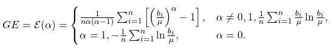

# Quick Reference for Fairness Measures
----
##  Fairness Metrics 

### Metrics by Category

There are three common categories of metrics for determining whether a model is considered "fair": Group Fairness, which compares the statistical similarities of predictions relative to known and discrete protected groupings; Similarity-Based Measures, which evaluate predictions without those discrete protected groups; and Causal Reasoning measures, which evaluate fairness through the use of causal models.

|**Category** |**Metric** |**Definition** |**Weakness** |**References** |
|------|------|------|------|------|
|Group Fairness |**Demographic Parity**| A model has **Demographic Parity** if the predicted positive rates (selection rates) are approximately the same for all protected attribute groups:        Harms Addressed: Allocative| Historical biases present in the data are not addressed and may still bias the model. | [Zafar *et al* (2017)](#zafar2017_ref) |
||**Equalized Odds**| Odds are equalized if $P(+)$ is approximately the same for all protected attribute groups.   **Equal Opportunity** is a special case of equalized odds specifying that $P(+ \rvert y = 1)$ is approximately the same across groups.     Harms Addressed: Allocative, Representational | Historical biases present in the data  are not addressed and may still bias the model. | [Hardt *et al* (2016)](#hardt2016_ref) |
||**Predictive Parity**| This parity exists where the Positive Predictive Value is approximately the same for all protected attribute groups.     Harms Addressed: Allocative, Representational | Historical biases present in the data are not addressed and may still bias the model.  | [Zafar *et al* (2017)](#zafar2017_ref) |
|------|------|------|------|------|
| Similarity-Based Measures |**Individual Fairness**| Individual fairness exists if "similar" individuals (ignoring the protected attribute) are likely to have similar predictions.     Harms Addressed: Representational | The appropriate metric for similarity may be ambiguous. |[Dwork (2012)](#dwork2012_ref), [Zemel (2013)](#zemel2013_ref), [Kim *et al* (2018)](#kim2018_ref) |
| &nbsp; |**Entropy-Based Indices**| Measures of entropy, particularly existing inequality indices from the field of economics, are applied to evaluate either individuals or groups     Harms Addressed: Representational |  |[Speicher (2018)](#speicher2018_ref) |
| &nbsp; |**Unawareness** | A model is unaware if the protected attribute is not used.     Harms Addressed: Allocative, Representational | Removal of a protected attribute may be ineffectual due to the presence of proxy features highly correlated with the protected attribute.| [Zemel *et al* (2013)](#zemel2013_ref), [Barocas and Selbst (2016)](#barocas2016_ref) |
|------|------|------|------|------|
| Causal Reasoning |**Counterfactual Fairness** \*| Counterfactual fairness exists where counterfactual replacement of the protected attribute does not significantly alter predictive performance. This counterfactual change must be propogated to correlated variables.   Harms Addressed: Allocative, Representational | It may be intractable to develop a counterfactual model.  | [Russell *et al* (2017)](#russell2017_ref) |
|------|------|------|------|------|
### Statistical Definitions of Group Fairness
|Metric |Statistical Criteria |Definition |Description |
|------|------|------|------|------|
|Demographic Parity|Statistical Independence |$R{\perp}G$ |sensitive attributes (A) are statistically independent of the prediction result (R) |
|Equalized Odds| Statistical Separation |$R{\perp}A\rvert{Y}$ |sensitive attributes (A) are statistically independent of the prediction result (R) given the ground truth (Y) |
|Predictive Parity |Statistical Sufficiency |$Y{\perp}A\rvert{R}$ |sensitive attributes (A) are statistically independent of the ground truth (Y) given the prediction (R)

From: [Verma & Rubin, 2018](#vermarubin)

## Fairness Measures

|Name |Definition |About |Aliases |
|------|------|------|------|
|**Demographic Parity** |  |Predictions must be statistically independent from the sensitive attributes. Subjects in all groups should have equal probability of being assigned to the positive class. Note: may fail if the distribution of the ground truth justifiably differs among groups  Criteria: Statistical Independence |Statistical Parity, Equal Acceptance Rate, Benchmarking |
|**Conditional Statistical Parity** | | Subjects in all groups should have equal probability of being assigned to the positive class conditional upon legitimate factors (L).  Criteria: Statistical Separation |&nbsp; |
|**False positive error rate (FPR) balance** | |Equal probabilities for subjects in the negative class to have positive predictions.   Mathematically equivalent to equal TNR: P(d=0\lvert{Y=0,G=m})=P(d=0\lvert{Y =0,G=f})  Criteria: Statistical Separation | Predictive Equality |
|**False negative error rate (FNR) balance**|  | Equal probabilities for subjects in the positive class to have negative predictions.   Mathematically equivalent to equal TPR: $P(d=1\lvert{Y=1,G=m})=P(d=1\lvert{Y=1,G=f})$.  Criteria: Statistical Separation | Equal Opportunity |
|**Equalized Odds**|  | Equal TPR and equal FPR. Mathematically equivalent to the conjunction of FPR balance and FNR balance  Criteria: Statistical Separation|  Disparate mistreatment, Conditional procedure accuracy equality |
|**Predictive Parity**|  | All groups have equal PPV (probability that a subject with a positive prediction actually belongs to the positive class.   Mathematically equivalent to equal False Discovery Rate (FDR): $P(Y=0\lvert{d=1,G=m})=P(Y=0\lvert{d=1,G=f})$  Criteria: Statistical Sufficiency |Outcome Test |
|**Conditional use accuracy equality**|   | Criteria: Statistical Sufficiency | &nbsp; |
|**Overall Accuracy Equity**|  |Use when True Negatives are as desirable as True Positives |&nbsp; |
|**Treatment Equality**|  | Groups have equal ratios of False Negative Rates to False Positive Rates |&nbsp; |
|**Calibration**|  | For a predicted probability score S, both groups should have equal probability of belonging to the positive class  Criteria: Statistical Sufficiency |Test-fairness, matching conditional frequencies |
|**Well-calibration**|  | For a predicted probability score S, both groups should have equal probability of belonging to the positive class, and this probability is equal to S  Criteria: Statistical Sufficiency |&nbsp; |
|**Balance for positive class**|  | Subjects in the positive class for all groups have equal average predicted probability score S  Criteria: Statistical Separation |&nbsp; |
|**Balance for negative class**|  | Subjects in the negative class for all groups have equal average predicted probability score S  Criteria: Statistical Separation |&nbsp; |
||||||
|**Causal discrimination**|  | Same classification produced for any two subjects with the exact same attributes |&nbsp; |
|**Fairness through unawareness**|  | No sensitive attributes are explicitly used in the decision-making process  Criteria: Unawareness | &nbsp; |
|**Fairness through awareness (Individual Fairness)**| for a set of applicants V , a distance metric between applicants k : V Å~V → R, a mapping from a set of applicants to probability distributions over outcomes M : V → δA, and a distance D metric between distribution of outputs, fairness is achieved iff  | Similar individuals (as defined by some distance metric) should have similar classification |Individual Fairness |
|**Counterfactual fairness**| A causal graph is counterfactually fair if the predicted outcome d in the graph does not depend on a descendant of the protected attribute G. |&nbsp; |&nbsp; |
||||||

  
## Interpretation of Common Measures 

|Group Measure Type|Examples| "Fair" Range |
|----|----|----|
|Statistical Ratio|Disparate Impact Ratio, Equalized Odds Ratio| 0.8 <= "Fair" <= 1.2|
|Statistical Difference (Binary Classification) |Equalized Odds Difference, Predictive Parity Difference| -0.1 <= "Fair" <= 0.1|
|Statistical Difference (Regression) | MAE Difference, Mean Prediction Difference | Problem Specific |

| Metric | Measure | Equation | Interpretation |
|:---- |:---- |:---- |:---- |
|**Group Fairness Measures - Binary Classification**  |Selection Rate| | - |
|&nbsp;|Demographic (Statistical) Parity Difference |  |(-) favors privileged group   (+) favors unprivileged group |
|&nbsp; |Disparate Impact Ratio (Demographic Parity Ratio)|  |< 1 favors privileged group    > 1 favors unprivileged group |
|&nbsp; |Positive Rate Difference|  |(-) favors privileged group   (+) favors unprivileged group |
|&nbsp; |Average Odds Difference|  |(-) favors privileged group   (+) favors unprivileged group |
|&nbsp; |Average Odds Error|  |(-) favors privileged group   (+) favors unprivileged group |
|&nbsp; |Equal Opportunity Difference|  |(-) favors privileged group   (+) favors unprivileged group |
|&nbsp; |Equal Odds Difference|  |(-) favors privileged group   (+) favors unprivileged group |
|&nbsp; |Equal Odds Ratio|  |< 1 favors privileged group    > 1 favors unprivileged group |
|**Group Fairness Measures - Regression**| Mean Prediction Ratio|  | < 1 favors privileged group    > 1 favors unprivileged group |
|&nbsp;  | Mean Prediction Difference|  | (-) favors privileged group   (+) favors unprivileged group |
|&nbsp;  | MAE Ratio|| < 1 favors privileged group    > 1 favors unprivileged group |
|&nbsp;  | MAE Difference|  | (-) favors privileged group   (+) favors unprivileged group |
|**Individual Fairness Measures** |Consistency Score |  | 1 is consistent   0 is inconsistent |
|&nbsp; |Generalized Entropy Index|  | - |
|&nbsp; |Generalized Entropy Error|  | - |
|&nbsp; |Between-Group Generalized Entropy Error|  | 0 is fair  (+) is unfair |

  
----
## References

Agarwal, A., Beygelzimer, A., Dudík, M., Langford, J., & Wallach, H. (2018). A reductions approach to fair classification. In International Conference on Machine Learning (pp. 60-69). PMLR. Available through [arXiv preprint:1803.02453](https://arxiv.org/pdf/1803.02453.pdf).

Barocas, S., & Selbst AD (201). Big data's disparate impact. California Law Review, 104, 671. Retrieved from [https://www.cs.yale.edu/homes/jf/BarocasDisparateImpact.pdf](https://www.cs.yale.edu/homes/jf/BarocasDisparateImpact.pdf)

Dwork, C., Hardt, M., Pitassi, T., Reingold, O., & Zemel, R. (2012, January). Fairness through awareness. In Proceedings of the 3rd innovations in theoretical computer science conference (pp. 214-226). Retrieved from [https://arxiv.org/pdf/1104.3913.pdf](https://arxiv.org/pdf/1104.3913.pdf)

Hardt, M., Price, E., & Srebro, N. (2016). Equality of opportunity in supervised learning. In Advances in neural information processing systems (pp. 3315-3323). Retrieved from [http://papers.nips.cc/paper/6374-equality-of-opportunity-in-supervised-learning.pdf](http://papers.nips.cc/paper/6374-equality-of-opportunity-in-supervised-learning.pdf)

Kim, M., Reingol, O., & Rothblum, G. (2018). Fairness through computationally-bounded awareness. In Advances in Neural Information Processing Systems pp. 4842-4852). Retrieved from [https://arxiv.org/pdf/1803.03239.pdf](https://arxiv.org/pdf/1803.03239.pdf)

Russell, C., Kusner, M.J., Loftus, J., & Silva, R. (2017). When worlds collide: integrating different counterfactual assumptions in fairness. In Advances in Neural Information Processing Systems (pp. 6414-6423). Retrieved from [https://papers.nips.cc/paper/7220-when-worlds-collide-integrating-different-counterfactual-assumptions-in-fairness.pdf](https://papers.nips.cc/paper/7220-when-worlds-collide-integrating-different-counterfactual-assumptions-in-fairness.pdf)

Verma, S., & Rubin, J. (2018, May). Fairness definitions explained. In 2018 ieee/acm international workshop on software fairness (fairware) (pp. 1-7). IEEE.

Zemel, R., Wu, Y., Swersky, K., Pitassi, T., & Dwork, C. (2013, February). Learning fair representations. International Conference on Machine Learning (pp. 325-333). Retrieved from [http://proceedings.mlr.press/v28/zemel13.pdf](http://proceedings.mlr.press/v28/zemel13.pdf)

Zafar, M.B., Valera, I., Gomez Rodriguez, M., & Gummadi, K.P. (2017, April). Fairness beyond disparate treatment & disparate impact: Learning classification without disparate mistreatment. In Proceedings of the 26th international conference on world wide web (pp. 1171-1180).  https://arxiv.org/pdf/1610.08452.pdf
